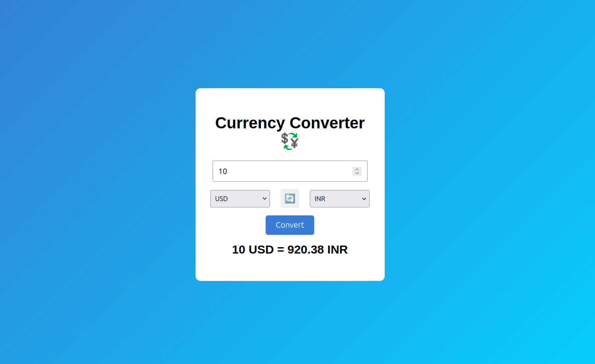

# 💱 Currency Converter

A simple and interactive **Currency Converter Web App** built using **HTML, CSS, and JavaScript**.
It allows users to convert amounts between different currencies using **real-time exchange rates**.

---

## 🚀 Features

* Convert between multiple currencies
* Real-time exchange rates using API
* Swap currencies with one click 🔄
* Clean and responsive UI
* Beginner-friendly JavaScript project

---

## 🛠️ Technologies Used

* **HTML5** – Structure of the application
* **CSS3** – Styling and layout
* **JavaScript (ES6)** – Logic and API handling
* **Exchange Rate API** – Live currency conversion data

---

## 📂 Project Structure

```
currency-converter
│
├── index.html
├── style.css
├── script.js
└── images/
```

---

## ⚙️ How to Run the Project

1. Clone the repository

```
git clone https://github.com/your-username/currency-converter.git
```

2. Open the project folder.

3. Run the project by opening:

```
index.html
```

in your browser.

---

## 🌐 API Used

This project uses a free exchange rate API:

```
https://open.er-api.com
```

It provides real-time currency conversion rates.

---

## 📸 Screenshots



---